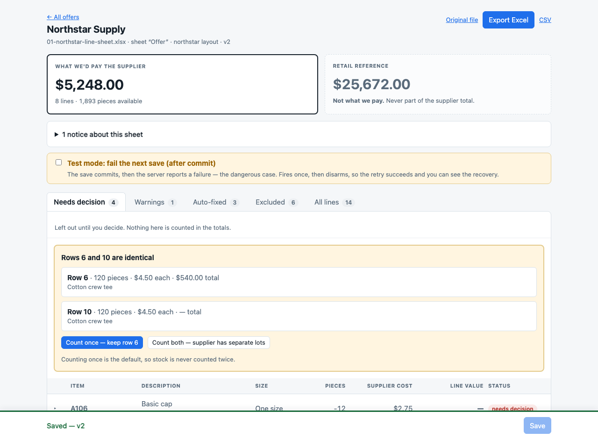
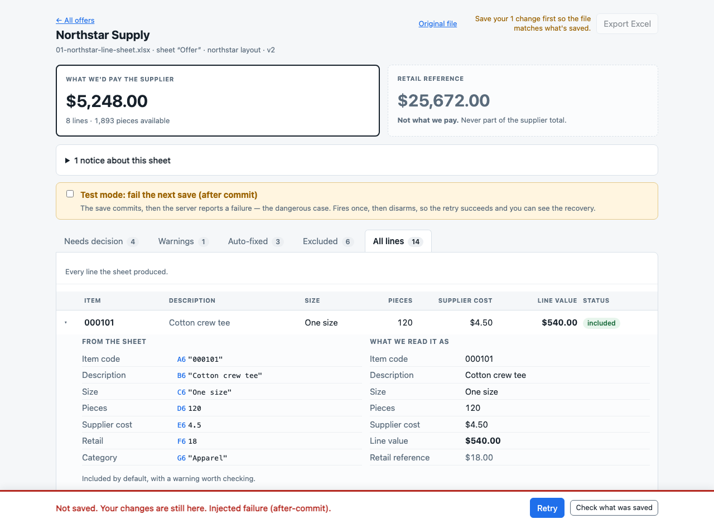
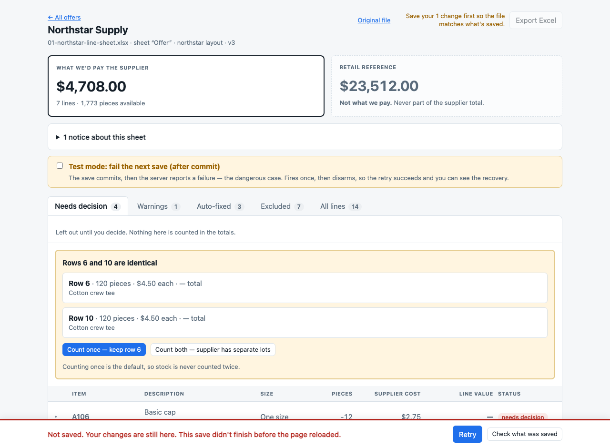
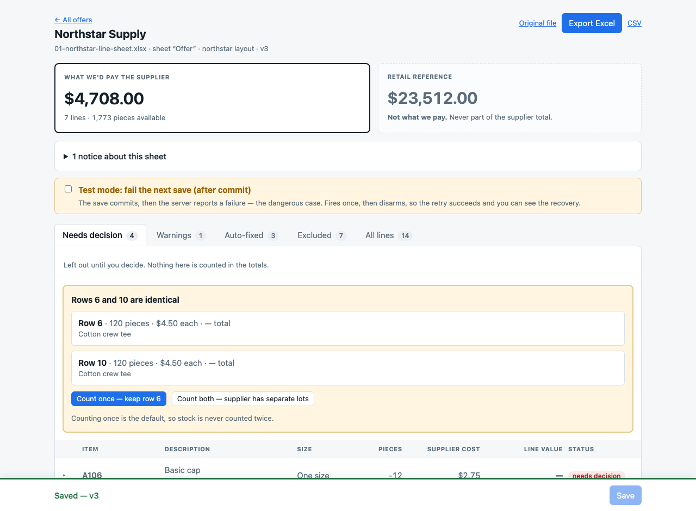

# Failure and recovery

The dangerous failure is not the one where nothing happens. It is the one
where the **save commits and the client is told it failed** — because the
obvious reaction, clicking Save again, is exactly what would double the
stock.

This is reproducible on demand. Set `FAULT_INJECTION=1` and the server
honours an `X-Fault` header:

| Header | What happens |
| --- | --- |
| `X-Fault: before-commit` | Roll back, return 503. Nothing was saved. |
| `X-Fault: after-commit` | Commit, **then** return 503. Saved, but the client thinks it failed. |

It is off unless the environment variable is set, so it cannot fire in
production. The UI shows a labelled toggle for it only when
`GET /api/config` reports it is on, and the toggle is **one-shot** — it arms
the next save and disarms itself, so the retry can succeed and the recovery
is actually visible.

## Reproducing it

```bash
cd backend
env -u DATABASE_URL DATABASE_URL="sqlite:///$PWD/demo.db" FAULT_INJECTION=1 \
  python -m uvicorn app.main:app --port 8821
```

Then in the browser: upload a sheet, tick **"Test mode: fail the next save
(after commit)"**, make a change, and press Save.

Or entirely from the terminal, which is what produced the output below.

---

## What the user sees

### 1. Before — a saved offer at v3



### 2. The save fails

The bar turns red: **"Not saved. Your changes are still here. Injected
failure (after-commit)."** with **Retry**, and a **Check what was saved**
link for anyone who wants to look before acting.



### 3. After a full page refresh, the failure is still recoverable

This is the part that usually breaks. `staged`, `inFlight` and the
`requestId` are persisted in `sessionStorage` keyed by offer id, so a reload
mid-failure does not strand the work: **"This save didn't finish before the
page reloaded."** — and Retry still reuses the *same* request id.



### 4. After Retry



All four states are captured automatically by the browser check:

```bash
node frontend/uicheck.mjs http://localhost:8821 docs/screenshots
```

---

## What the database does

Real output. `dbstate` reads the SQLite file directly, beside what the API
reports.

```
OFFER=d4457e4a-0397-41c9-a342-66bf434ae030
REQUEST_ID=CF47D536-25EA-47D5-9455-90C3CBB20671

### 1. Before the save
offers.version=1  decisions=0  save_requests=0  rows=[]
   API: v1  1733 pieces  $4208.00

### 2. Save with X-Fault: after-commit
   HTTP 503  {"detail":"Injected failure (after-commit)."}

### 3. After the failure (client thinks it failed)
offers.version=2  decisions=1  save_requests=1  rows=[('R14', 'include', 50000)]
   API: v2  1833 pieces  $4708.00

### 4. Retry with the SAME request_id
   HTTP 200  {"offer_id":"d4457e4a-...","request_id":"cf47d536-...","version":2,"applied":1}

### 5. After the retry
offers.version=2  decisions=1  save_requests=1  rows=[('R14', 'include', 50000)]
   API: v2  1833 pieces  $4708.00

### 6. Retry twice more (idempotent)
   HTTP 200
   HTTP 200
offers.version=2  decisions=1  save_requests=1  rows=[('R14', 'include', 50000)]
```

Read the version column down the page: **1 → 2 → 2 → 2 → 2**. The work
happened once. Three further retries of the same `request_id` return the same
receipt and write nothing — one decision row, one `save_requests` row, no
second version bump, and the pieces never move past 1,833.

`50000` is the cost in units: $5.00 stored as integer ten-thousandths, never
a float.

(The request id was generated by `uuidgen` in uppercase and comes back
lowercase — it is normalised to a canonical UUID, so the same id in either
case is the same key.)

## The harmless failure, for contrast

```
### before-commit fault
{"detail":"Injected failure (before-commit)."}   HTTP 503
   DB after rollback: version=1  decisions=0  save_requests=0

### the same request_id now succeeds (nothing was stored)
{"offer_id":"c6c8bf84-...","version":2,"applied":1}   HTTP 200
   DB now: version=2  decisions=1
```

Nothing was written, so no receipt was stored either — and the retry is
therefore a *first* attempt, which is why it applies normally. The version
goes 1 → 1 → 2, again a single bump.

## Someone else saved while you were editing

```
### stale base_version (another window already saved)
{"detail":"This offer changed in another window. Reload the latest version.","current_version":2}
   HTTP 409
```

The UI turns this into **"Changed in another window. Reload latest"**, then
offers to re-apply the pending edits — naming any line the other window
already decided and requiring an explicit choice before overwriting it.

## Why a retry cannot double anything

Three things, each doing one job:

- **`request_id`** answers *"have I already done this work?"* Its receipt is
  written inside the same transaction as the decisions, so a committed save
  always has a receipt to find. A retry becomes a lookup.
- **`base_version`** answers *"is this work still based on what the user
  saw?"* Enforced by `UPDATE offers SET version = version + 1 WHERE id = :id
  AND version = :base`; `rowcount == 0` is the 409.
- **Decisions are upserted, never appended.** Even a bug that applied the
  same batch twice could not produce two rows for one line.

The `request_id` check runs **before** the version check on purpose: a retry
after an after-commit failure carries a `base_version` that is stale
*because its own earlier commit made it stale*. Check the version first and
every such retry gets a 409, the user reloads and re-applies, and the change
lands twice — the precise bug this demo exists to rule out.

Covered by `test_after_commit_failure_then_retry_applies_exactly_once`,
`test_before_commit_failure_saves_nothing`, and the concurrency tests in
`backend/tests/test_api.py`.
